# MataBank Banking Website

> Full-stack demo banking website with customer, employee, and administrator workflows, wallet management, transactions, and spending analytics.

> COMP 380: Software Engineering university project.


## Overview

**MataBank Banking Website** is a full-stack banking web application created as a university software engineering project. The system simulates a banking platform with role-based access for **Customers**, **Employees**, and **Administrators**.

The application includes account registration, login, wallet/card management, deposits, withdrawals, incoming transaction requests, spending analytics, account details, downloadable account statements, employee monitoring tools, and administrative account-management controls.

This project was designed as an educational/demo banking system, not a production financial platform.

---

## Course Context

- **Course:** COMP 380: Software Engineering
- **Project:** MataBank Banking Website
- **Type:** University group project
- **Project Timeline:** January 2025 – May 2025
- **Focus:** Requirements analysis, system design, implementation, verification, validation, and project management

Project documentation is included in the `docs/` folder, including requirements, design, implementation notes, verification/validation material, and project-management documents.

---

## Tech Stack

| Layer | Technologies |
|---|---|
| Frontend | HTML, CSS, JavaScript |
| Backend | Node.js, Express.js |
| Database | MySQL |
| ORM / Database Access | Sequelize, mysql2 |
| Authentication | JWT-based login flow |
| Session Handling | Browser `sessionStorage` |
| Charts / Analytics | Frontend chart visualizations |
| Documentation | SRS, SDD, Verification Plan, Project Management Plan, Presentation |

---

## Main Features

### Role-Based Login

The login page supports three user roles:

- **User / Customer**
- **Employee**
- **Admin**

Each role opens a different dashboard and feature set.


---

## Customer Features

### Account Registration

Customers can create accounts through a full registration form with personal information, gender selection, date of birth, email, password, confirm-password validation, and terms agreement.

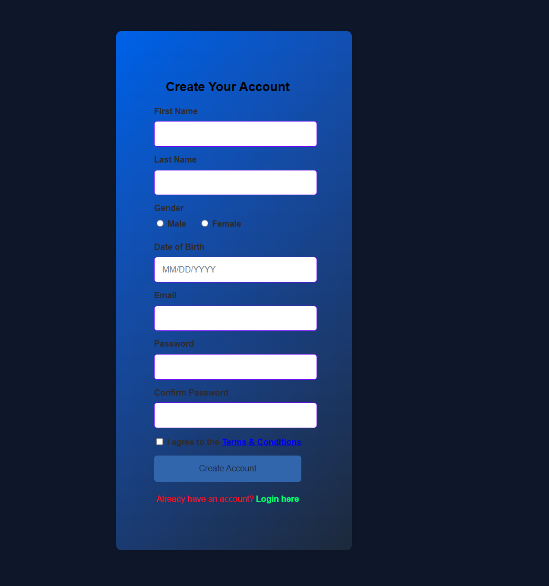

After successful registration, the user receives a confirmation screen before logging in.

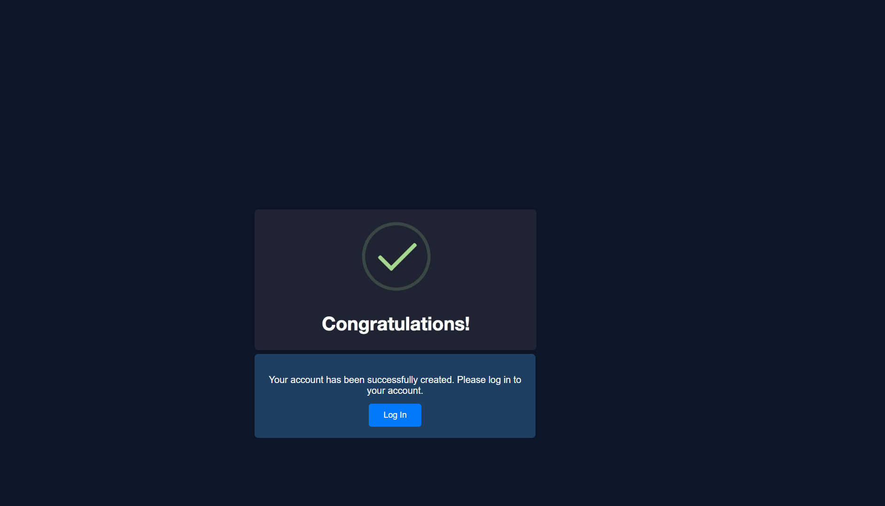

---

### Customer Dashboard

The customer dashboard summarizes account activity in one view:

- Total balance
- Total income
- Total expenses
- Active wallets
- Spending breakdown chart
- Spending trend chart
- Recent activity list
- Sidebar navigation

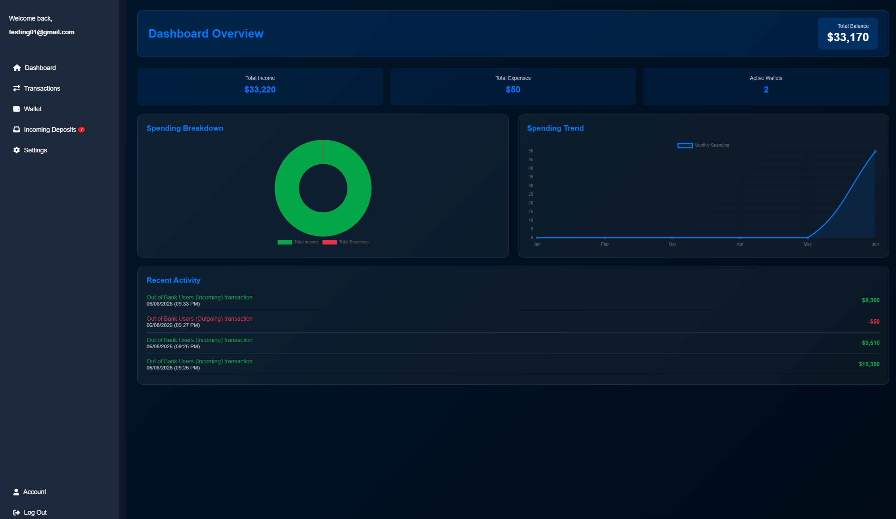

---

### Transaction Workflow

The transaction area is divided into three main sections:

- **Deposit**
- **Withdrawal**
- **Spend Analysis**

The deposit and withdrawal flows both support transactions involving internal bank users and external cards.

#### Deposit Options

Customers can choose between:

- **Bank Users:** deposit/send money to another user inside the bank
- **Out of Bank Users:** deposit money to an external card

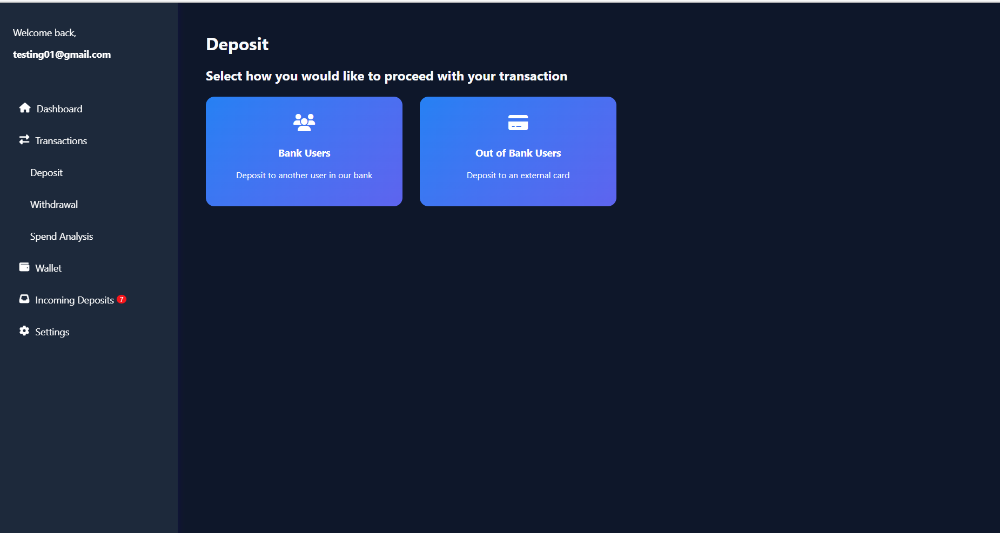

#### Withdrawal Options

Customers can choose between:

- **Bank Users:** withdraw/send money to another user inside the bank
- **Out of Bank Users:** withdraw money to an external card

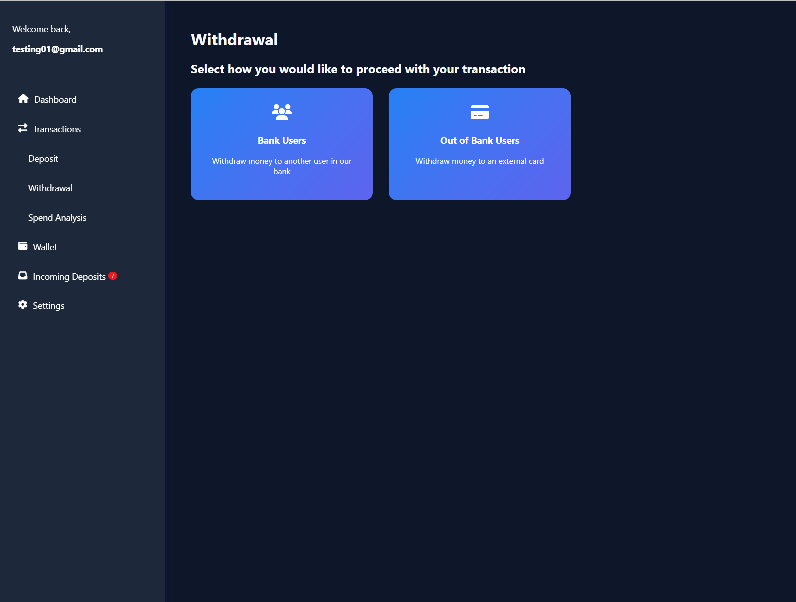

---

### Spending Analysis

The spending analysis page includes:

- Card filter
- Month selector
- Spending trends chart
- Transaction history table
- Income/expense color distinction
- Masked card display

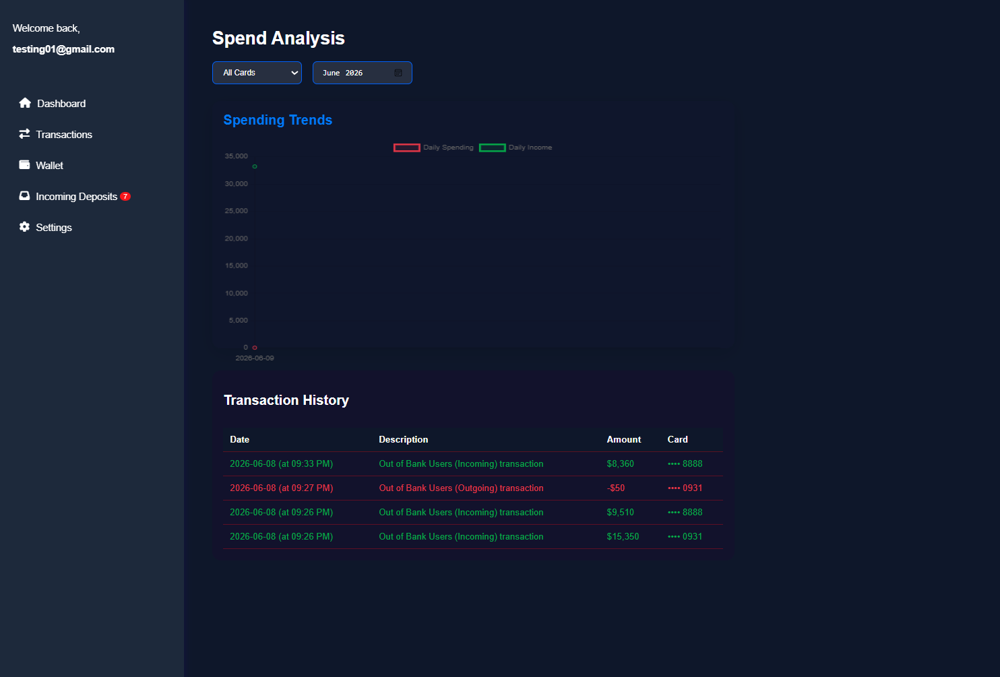

---

### Wallet Management

Customers can manage active wallet cards from the wallet page.

Supported wallet features include:

- View existing Visa/Master wallets
- View balances, cardholder names, card numbers, expiration dates, and CVV values
- Remove wallets
- Add an existing/manual card
- Automatically create a new Visa or Master wallet

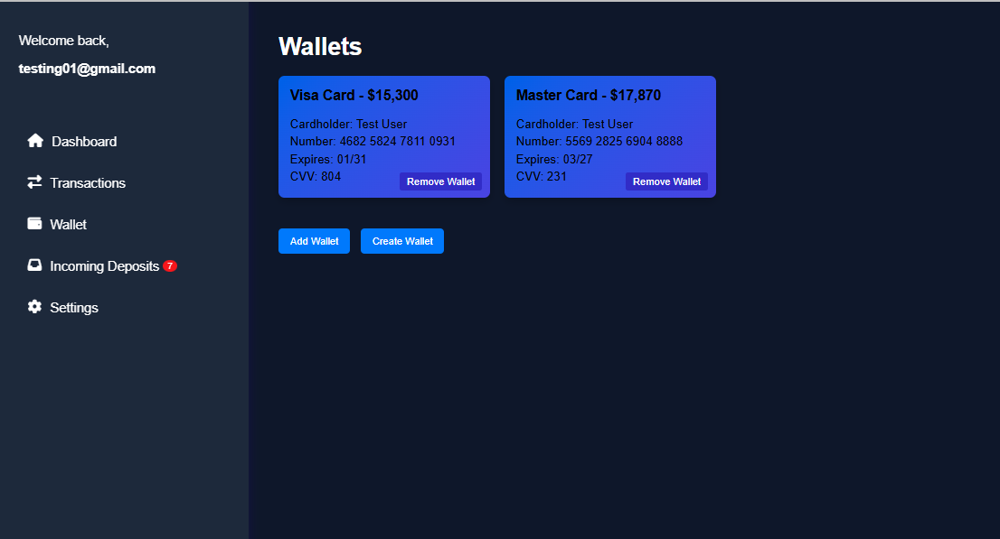

---

### Incoming Transaction Requests

The incoming transaction page handles internal bank-user transaction requests.

Customers can:

- View pending incoming/outgoing transaction requests
- Confirm or reject requests
- Select which wallet/card to use when confirming
- View incoming transaction history
- Filter history by incoming or outgoing transactions

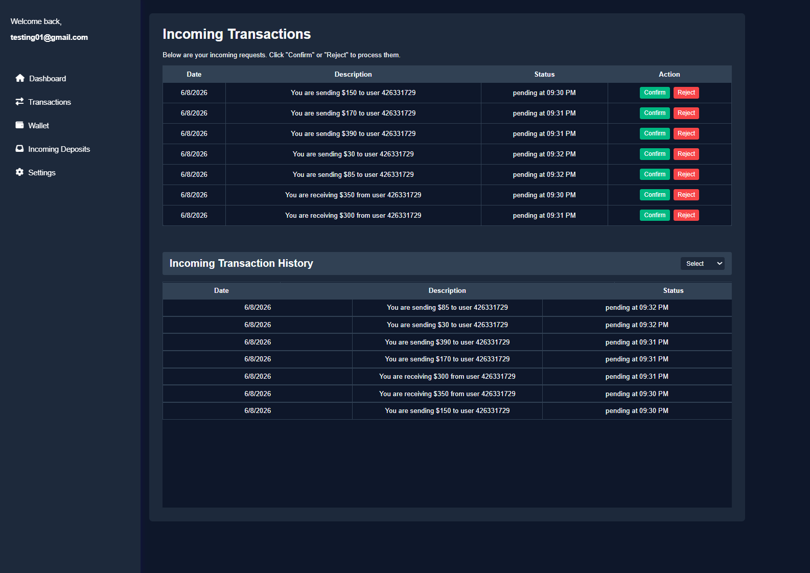

---

### Account Details and Statements

The account page includes two major sections:

1. **Personal Details**
   - Full name
   - Phone number
   - Mailing address
   - Date of birth
   - Account ID
   - Edit profile workflow

2. **Account Overview**
   - Account balances by card
   - Transaction history
   - Masked card numbers
   - Downloadable plain-text account statement

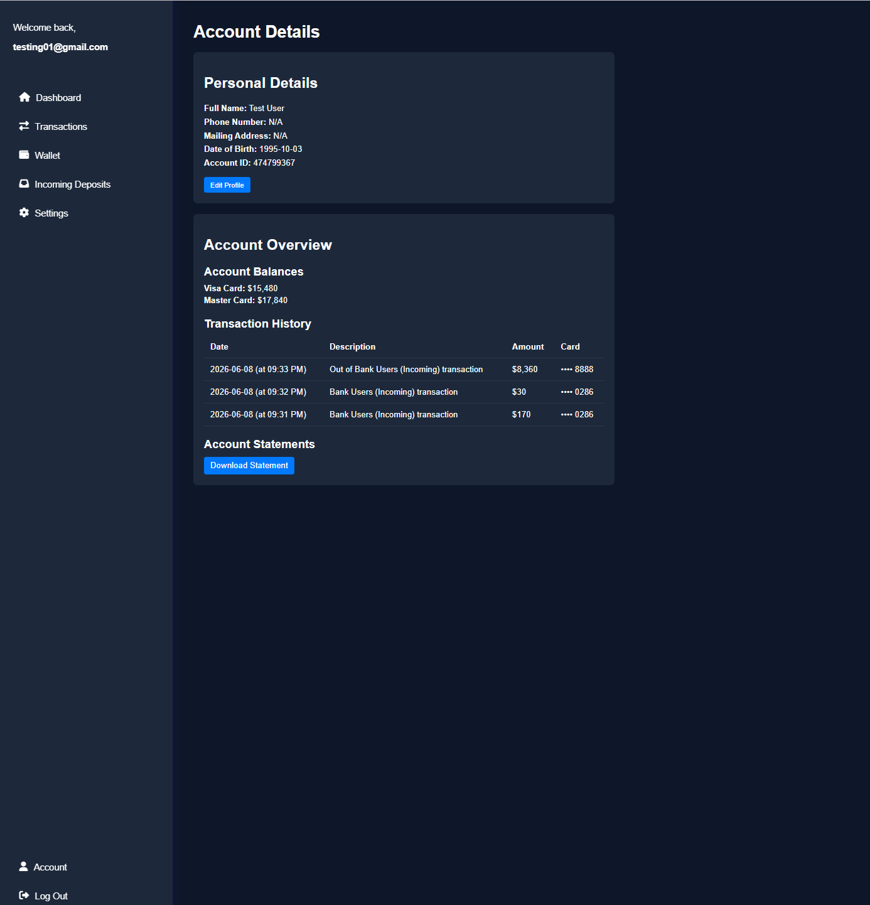

---

### Settings

Customers can update account settings, including:

- Change email
- Change password

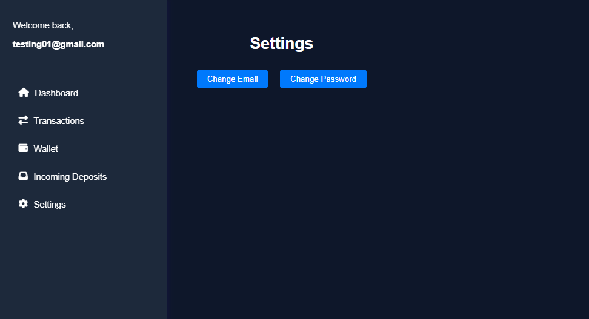

---

## Employee Dashboard

The Employee dashboard is designed for monitoring and review.

Employees can:

- View registered users
- Search users by account ID
- Review card statistics
- View financial summaries
- Filter transaction history
- Filter by transaction direction/status
- Inspect selected card details

Employees are primarily read-only users and do not directly modify customer accounts.

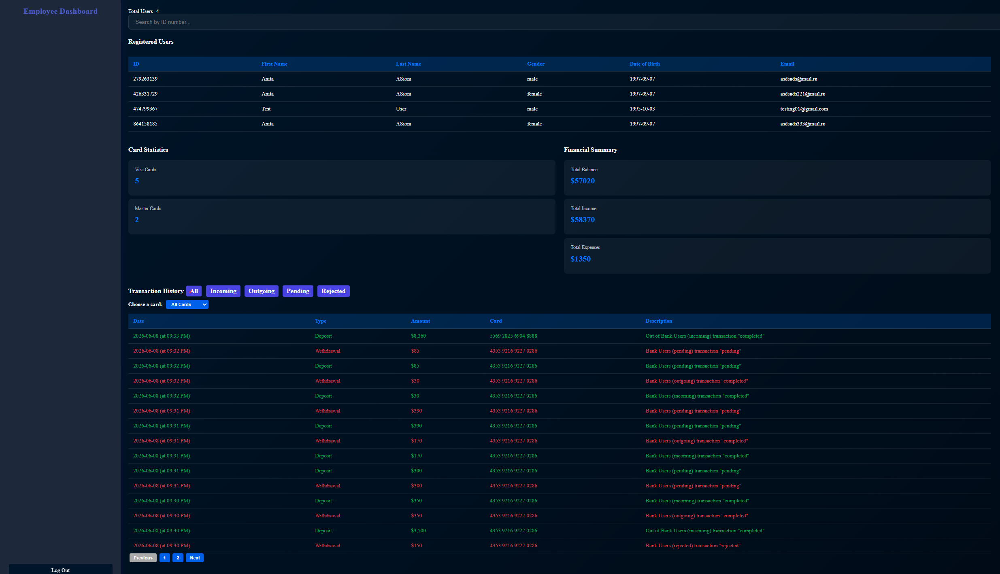

---

## Admin Dashboard

The Admin dashboard includes monitoring tools plus account-management actions.

Administrators can:

- View registered users
- Search users by account ID
- Review card statistics
- View financial summaries
- Filter transaction history by status/direction
- Filter by selected card
- View selected card details
- Edit user email/password
- Delete a user card
- Delete a full user account
- Suspend or reactivate user accounts
- Suspend or reactivate selected transactions
- Manually deposit money to a user/card
- Manually withdraw money from a user/card

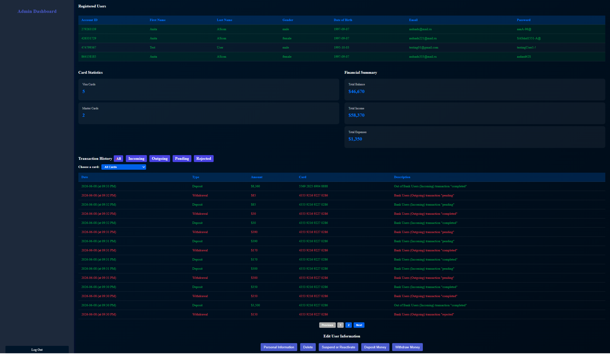

### Admin Account and Transaction Controls

The admin suspend/reactivate workflow allows the administrator to select a user, choose a card, view related transactions, and suspend or reactivate specific account or transaction activity.

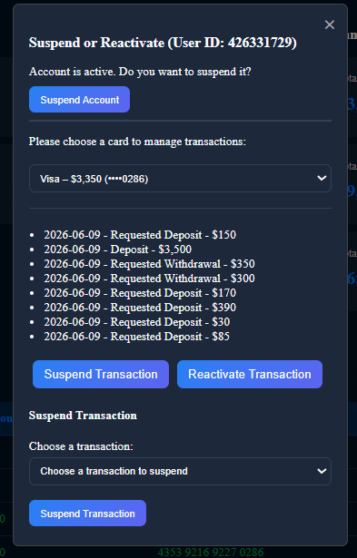

---

## Project Structure

```text
MataBank-Banking-Website/
├── backend/
│   ├── config/
│   ├── controllers/
│   ├── migrations/
│   ├── models/
│   ├── routes/
│   ├── .env.example
│   ├── db.js
│   ├── package.json
│   ├── package-lock.json
│   └── server.js
│
├── frontend/
│   ├── css/
│   ├── images/
│   ├── js/
│   ├── pages/
│   └── index.html
│
├── images/
│   └── static app assets, favicons, and background images
│
├── docs/
│   ├── 1. Requirements/
│   ├── 2. Design/
│   ├── 3. Implementation/
│   ├── 4. Verification and Validation/
│   └── 5. Project Management/
│
├── screenshots/
│   └── README screenshots
│
├── .gitignore
└── README.md
```

---

## Getting Started

### Prerequisites

Install the following before running the project:

- Node.js
- npm
- MySQL Server
- MySQL Workbench or another MySQL client

---

## Backend Setup

Open a terminal in the backend folder:

```powershell
cd backend
npm install
```

Create a local environment file:

```text
backend/.env
```

Use `backend/.env.example` as the template.

Example:

```env
PORT=3000

DB_NAME=banking_app
DB_USER=myappuser
DB_PASSWORD=your_mysql_password
DB_HOST=localhost
DB_DIALECT=mysql

JWT_SECRET=replace_with_long_random_secret

INIT_DB=false
```

---

## Database Setup

Create the MySQL database and application user:

```sql
CREATE DATABASE IF NOT EXISTS banking_app;

CREATE USER IF NOT EXISTS 'myappuser'@'localhost' IDENTIFIED BY 'your_mysql_password';

GRANT ALL PRIVILEGES ON banking_app.* TO 'myappuser'@'localhost';

FLUSH PRIVILEGES;
```

Then make sure the values in `backend/.env` match your MySQL configuration.

---

## Running the App

From the backend folder:

```powershell
node server.js
```

Then open the app in a browser:

```text
http://localhost:3000
```

---

## Documentation

The `docs/` folder contains the major course deliverables:

| Folder | Content |
|---|---|
| `docs/1. Requirements/` | Software Requirements Specification |
| `docs/2. Design/` | Software Design Document |
| `docs/3. Implementation/` | Implementation instructions |
| `docs/4. Verification and Validation/` | Software Verification Plan |
| `docs/5. Project Management/` | Project Management Plan |

Large video files are intentionally excluded from GitHub.

---

## Security Notice

MataBank is a **student/demo software engineering project** created for learning and portfolio purposes. It is **not** a real banking system and must not be used to store, process, or transmit real financial, personal, or authentication data.

Some security-sensitive features are simplified for course/demo purposes, including authentication, role management, password handling, transaction controls, and local development configuration.

Before any production-style use, the project would require major security improvements, including:

- Password hashing with bcrypt or another secure hashing method
- Removal of password display from admin/customer interfaces
- Strong server-side authorization middleware
- Secure token storage and expiration handling
- Stronger JWT secret management
- HTTPS
- Input validation and sanitization
- Audit logging for admin actions
- Protection against common web vulnerabilities
- Full security review and penetration testing

---

## Team and Contributions

This was a COMP 380 Software Engineering group project by:

- Lernik Avetisyan
- Gus Axelson
- Lance Jimenez
- Anthony Taylor

Lernik Avetisyan was responsible for the main implementation, backend/frontend integration, authentication and session logic, transaction workflows, testing/fixes, project documentation, and final demo support.

---

## Future Improvements

Possible improvements include:

- Add password hashing and remove plain-text password display
- Strengthen backend role-based access control
- Add middleware-protected API routes
- Add automated tests
- Improve form validation and error handling
- Add admin audit logs
- Improve mobile responsiveness
- Add database seed scripts
- Add production deployment configuration

---

## License, Usage, and Academic Integrity Notice

Copyright (c) 2026 Lernik Avetisyan. All rights reserved.

This project is publicly available for educational review, portfolio review, and demonstration purposes only. Viewing or accessing this repository does not grant permission to copy, modify, distribute, publish, submit, sublicense, sell, or use this project, in whole or in part, without prior written approval from the author.

Copying, reusing, submitting, or claiming any part of this project as someone else's work is strictly prohibited, including for academic coursework, personal projects, or commercial purposes.

No license is granted for commercial use, redistribution, derivative works, or incorporation into other software or projects without prior written permission from the author.
